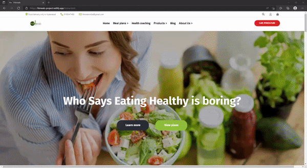

## Fitmeals Clone

This is a clone of an ecommerce website which is a project we got in our construct week of second unit in Masai school.

## Live Demo : https://fitmeals-project.netlify.app/

## Tech stack used :
* HTML 
* CSS
* JavaScript.

We have deployed the website on Netlify.

We have added advanced css animations on the homepage to make the UI more attractive.

Hamburger menu has been implemented so that the mobile users can navigate through pages very easily.

The functionality of website such as login, signup, product pages and add to cart has been added.

The website has been made very responsive which is very useful on devices with small screens it supports display of all sizes.

Grid and flex have been implemented to achieve the layouts on different pages.

Clone the repository or download the code and run home.html file and enjoy browsing.

First project..!!!

