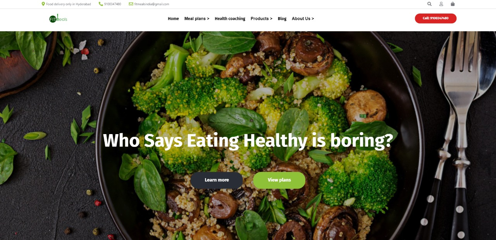

**Fitmeals Clone**

This is a clone of a ecommerce website which is a project we got in our construct week of second unit in Masai school.

Live Demo : https://fitmeals-project.netlify.app/

The stack used is HTML, CSS and Javascript.

The functionality of website such as login, signup, product pages and add to cart has been added.
The website has been made very responsive which is very useful on devices with small screens.

As there is no backend data servers you will have to open the data_1245.html on your browser to access the data on your local storage. 
Now you can open the home.html and navigate through our website.

First project..!!!

